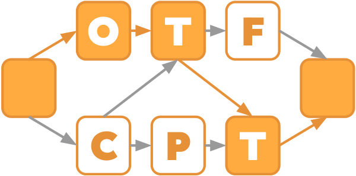

# On-the-fly critical-path tool


Tool to collect and report model factors (aka. fundamental performance factors) for hybrid MPI + OpenMP applications on-the-fly.

## Building with CMake
The C/C++ compiler needs to support OMPT (which is provided by icc/clang and others, but not gcc)
### Basic Cmake
```
mkdir BUILD
cd BUILD
cmake ../
make -j8
```

### Building with Clang
To use clang with IntelMPI/OpenMPI/MPICH, export the following env variables first:
```
export MPICH_CC=clang; export MPICH_CXX=clang++;
export OMPI_CC=clang; export OMPI_CXX=clang++;
mkdir BUILD
cd BUILD
cmake ../
make -j8
```

### Using libc++ with Clang-based compilers
For broad compatibility with applications and libraries built with mixed
compiler setups (e.g. gfortran + clang++), OTF-CPT tries to avoid dependency 
to a C++ runtime library. If GNU C++ headers are available, they are 
preferred for building OTF-CPT (which is also the default). 

If no GNU C++ headers are available, OTF-CPT can be built by explicitly using
LLVM's C++ runtime library (libc++) by configuring OTF-CPT with the cmake
flag `-DOTFCPT_USE_LLVM_LIBCPP=ON`.

### Building with MPICH + Clang on Ubuntu
The MPICH compiler wrapper on Ubuntu bricks MPI detection in cmake, work-around as following:
```
export MPICH_CC=clang; export MPICH_CXX=clang++;
mkdir BUILD
cd BUILD
CC=mpicc.mpich CXX=mpicxx.mpich LDFLAGS=-flto=auto cmake ../
make -j8
```

### Building with OpenMPI + Clang on Ubuntu
```
export OMPI_CC=clang; export OMPI_CXX=clang++;
mkdir BUILD
cd BUILD
CC=mpicc.openmpi CXX=mpicxx.openmpi cmake ../
make -j8
```

## Using the tool with an application
Depending on the system and how libomp.so is built, LD_PRELOAD and OMP_TOOL_LIBRARIES might both be necessary. Assuming a cmake build as described above, an application with OTF-CPT is executed like:
```
$(MPIRUN) -np 2 env OMP_NUM_THREADS=4 LD_PRELOAD=./BUILD/libOTFCPT.so OMP_TOOL_LIBRARIES=./BUILD/libOTFCPT.so ./app
```

At the moment, the tool supports selective instrumentation with a single pair of start/stop markers:
```
MPI_Pcontrol(1); // start
// region of interest
MPI_Pcontrol(0); // stop
```

or alternatively for OpenMP applications:
```
omp_control_tool(omp_control_tool_start, 0, NULL); // start
// region of interest
omp_control_tool(omp_control_tool_stop, 0, NULL); // stop
```

In both cases the runtime option `stopped=1` should be used, see below.

### Runtime options
The behavior of OTF-CPT can be changed with different runtime options. All
runtime options are exported as a space separated string assigned to
`OTFCPT_OPTIONS`. For a full list of runtime options refer to the `help` option.

E.g.:
```
export OTFCPT_OPTIONS="verbose=1 start_stopped=1 help=1"
```

<table border="2" cellspacing="0" cellpadding="6" rules="groups" frame="hsides">


<colgroup>
<col  class="org-left" />

<col  class="org-right" />

<col  class="org-left" />
</colgroup>
<thead>
<tr>
<th scope="col" class="org-left">Flag Name</th>
<th scope="col" class="org-right">Default value</th>
<th scope="col" class="org-left">Description</th>
</tr>
</thead>

<tbody>
<tr>
<td class="org-left">stopped</td>
<td class="org-right">0</td>
<td class="org-left">Delay the start of measurement until a start marker is
encountered.</td>
</tr>
</tbody>

<tbody>
<tr>
<td class="org-left">data_path</td>
<td class="org-right">stdout</td>
<td class="org-left">Write metric data to "&lt;data_path&gt;-&lt;#procs&gt;x&lt;#threads&gt;.txt". Special values are "stdout" and "stderr". Overwrites the file without checking.</td>
</tr>
</tbody>

<tbody>
<tr>
<td class="org-left">log_path</td>
<td class="org-right">stdout</td>
<td class="org-left">Write logging output to "&lt;log_path&gt;.&lt;pid&gt;". Special values are "stdout" and "stderr". Only relevant with verbose=1</td>
</tr>
</tbody>

<tbody>
<tr>
<td class="org-left">verbose</td>
<td class="org-right">0</td>
<td class="org-left">Print additional statistics.</td>
</tr>
</tbody>

<tbody>
<tr>
<td class="org-left">enable</td>
<td class="org-right">1</td>
<td class="org-left">Use OTF-CPT during execution.</td>
</tr>
</tbody>
</table>

## Plotting results of a scaling experiment

The script `CPT-plot.py` expects all OTF-CPT output files for a scaling experiment in a single directory.
The script expects the relative or absolute path of this directory as an argument. The directory name 
will be used as experiment name when generating the output.
The individual output files should follow the naming convention `<prefix>-<nprocs>x<nthreads>.<suffix>`.
Prefix and suffix can be chosen freely, the script will only open and parse files with names containing 
`-<nprocs>x<nthreads>.`.

In the following example we have five output files, execute the script which renders four graphic files 
with color coded metric table and scaling plots:
```
$ ls script/data
data-128x12.txt  data-16x12.txt  data-32x12.txt  data-64x12.txt  data-8x12.txt
$ python3 script/CPT-plot.py script/data
$ ls data_*
data_graph.pdf  data_graph.png  data_metrics.pdf  data_metrics.png
```


## Files
### MPI Function Wrappers
- completion-wrappers.cpp  - Request completion calls
- man-wrappers.cpp     - Manually modified MPI wrappers with special semantics regarding handles
- gen-nb-wrappers.cpp  - Generated non-blocking communication calls
- gen-wrappers.cpp     - Generated MPI wrappers with simple IN or OUT semantics regarding handles
- tracking.cpp         - implementation of some class functions defined in handle-data.h and tracking.h 

### OTF-CPT
- critical-core.cpp  - OTF-CPT core functions
- ompt-critical.cpp  - OMPT specific code for OTF-CPT
- mpi-critical.cpp   - MPI specific code for OTF-CPT

### wrap.py Templates
- gen-nb-wrappers.w
- gen-wrappers.w

```
external/wrap/wrap.py -s -n gen-wrappers.w -o gen-wrappers.cpp
```

## Publications

- **Joachim Protze, Fabian Orland, Kingshuk Haldar, Thore Koritzius, Christian Terboven**: *On-the-Fly Calculation of Model Factors for Multi-paradigm Applications*. Euro-Par 2022
- **Joachim Jenke, Michael Knobloch, Marc-André Hermanns, Simon Schwitanski**: *A Shim Layer for Transparently Adding Meta Data to MPI Handles*. EuroMPI 2023